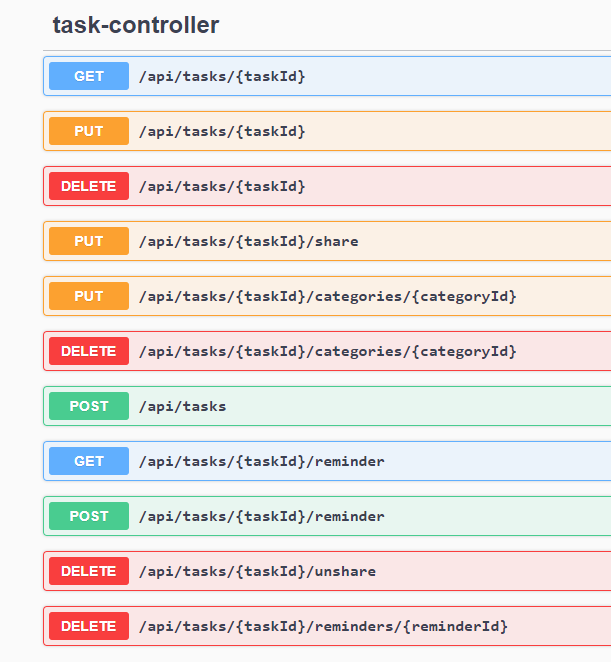
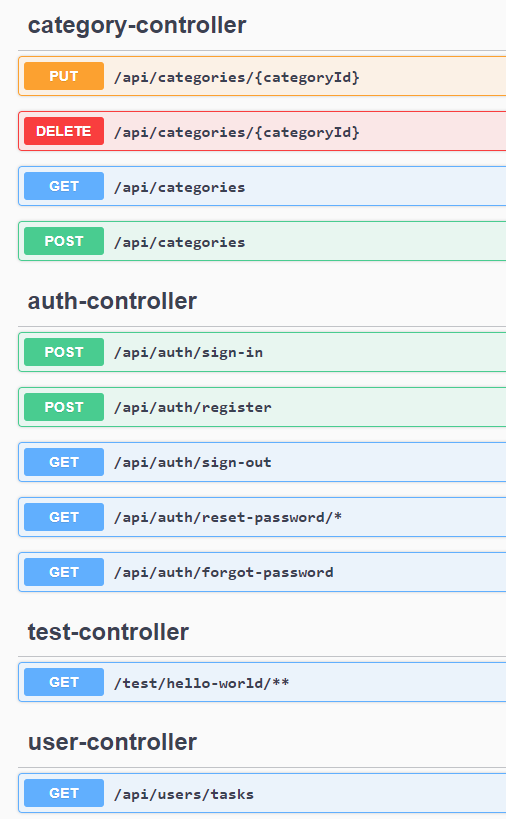

# TaskMaster - Task Management Application

TaskMaster is a versatile and user-friendly task management application designed to help individuals and teams efficiently organize and track their tasks and to-do lists. With its intuitive interface and robust features, TaskMaster simplifies the management of tasks, ensuring that users can stay productive and organized.

## Key Features:

### User Registration and Authentication:

- Register an account with TaskMaster to access all features securely.
- Log in to your account with a username and password.
- Log out to protect your account's security.

### Task Management:

- Create tasks with titles, descriptions, due dates, categories, and priority flags.
- View a list of all tasks, filterable by status (pending or completed) and category (work, personal, etc.).
- View detailed information about a single task.
- Update and edit task details as needed.
- Delete tasks that are no longer relevant.

### Category Management:

- Create and manage task categories to organize your tasks effectively.
- Edit and update category names and colors.
- Delete categories when they are no longer needed.

### Reminder and Notification:

- Set reminders for tasks with customizable dates and times.
- Receive notifications for upcoming tasks and deadlines.
- View and manage your reminders easily.

### Collaboration and Sharing (Optional):

- Share tasks with other users.
- Assign tasks to team members.
- Comment on tasks to facilitate communication.

### Attachments:

- Upload attachments related to tasks for easy reference.
- Download attachments when needed.

### Administrator Features (If applicable):

- Admins can access user management features.
- Admins can view user tasks for administrative purposes.

### Security and Privacy:

- TaskMaster prioritizes user data security and privacy.
- Authentication and authorization mechanisms ensure data protection.
- User data is encrypted and stored securely.

### Web
Application is available on below localhost with port 8081

### Available Endpoints
After run application you can check on http://localhost:8081/swagger-ui/ which endpoints are available

### Login to MySQL database
make sure your database is running and task_master database is created manually.
Rest of the tables will be generated automatically by application.

### Example usages
It is possible for testing API in Swagger, Postman, curl and endpoints with GET Mapping directly on browser
Let me show some of the examples:

### Add task in Swagger:

## Getting Started:

1. Clone the TaskMaster repository.
2. Install the required dependencies.
3. Configure the application settings.
4. Run the application.

## Contributing:

We welcome contributions from the community. If you would like to contribute to TaskMaster, please follow our [Contribution Guidelines](CONTRIBUTING.md).

## License:

This project is licensed under the MIT License. See the [LICENSE](LICENSE) file for details.

---

© 2023 TaskMaster
